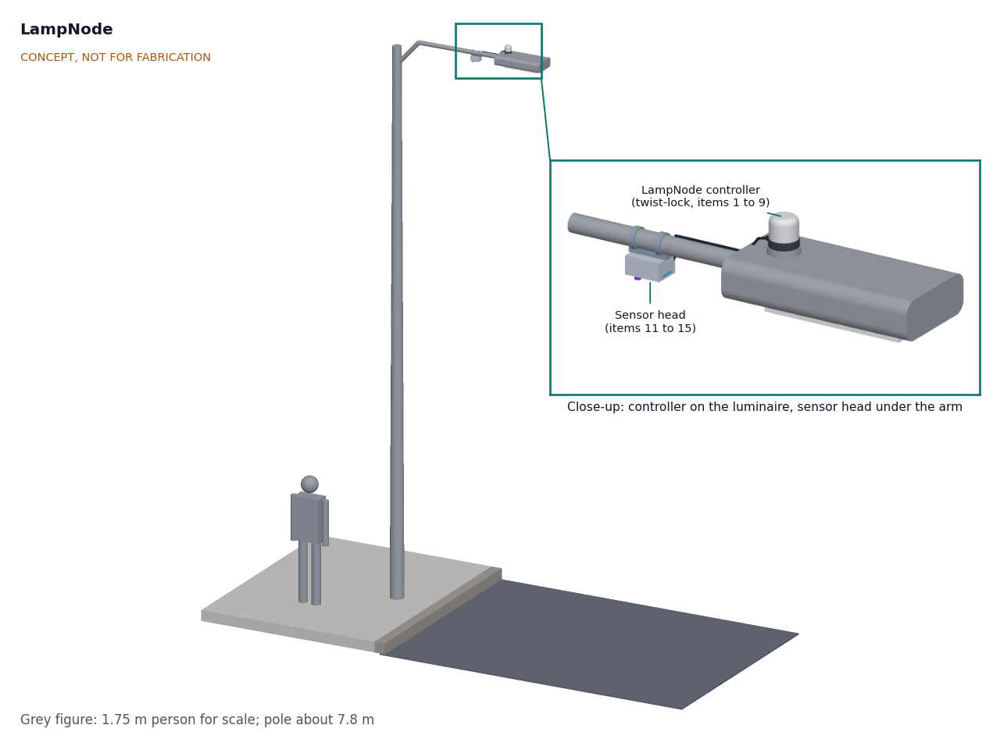

# LampNode

  

**Area:** Smart Cities · **TRL:** 2 of 9 (concept formulated) · **Prototype budget:** about $150 USD · **Difficulty:** 3 of 5

An open streetlight controller that dims LED streetlights by schedule and presence, reports faults and hosts other city sensors on the lamp pole.

[Interactive 3D model](media/viewer.html) · [Concept blueprint (PDF)](media/concept-blueprint.pdf) · [Review note](docs/REVIEW.md)

## Concept rationale

Many LED streetlights, especially in North America, already have a twist-lock socket on top, built for a photocell. A controller that plugs into that socket can dim the lamp, measure its energy and report faults without anyone opening the luminaire or the pole. LampNode uses that socket, the 0 to 10 V dimming input most LED drivers already have, and a small radar head under the arm that raises the light only when someone is coming. Because the controller already has mains power and a radio on the pole, the same head offers two powered ports for other city sensors, so a street can gain air, noise or traffic sensing without new wiring.

It is open and garage-buildable because the main problem with smart streetlights is not the electronics but lock-in: the controller, network and software usually come from one supplier. LampNode uses a standard socket, the same LoRaWAN radio as the lab's FieldNode, and a published message format, so a city, a utility or a campus can build, inspect or replace any part of it and read its data with any LoRaWAN server, including TwinKit and CityTwin.

## Burning platform

Streetlights mostly burn at full power all night, and cities often cannot see what they use: the US Energy Information Administration says it has no estimate of electricity use for public street and highway lighting ([EIA](https://www.eia.gov/tools/faqs/faq.php?id=99&t=3)). Yet the savings from dimming are large. On 14 LED-lit Swedish roads, a dimming schedule alone could save about 49 % of the energy ([Jägerbrand, 2016](https://www.mdpi.com/1996-1073/9/5/357)). Meanwhile citizen observations from 2011 to 2022 are consistent with the night sky brightening by 7 to 10 % per year ([Kyba et al., 2023, via GFZ](https://www.gfz.de/en/press/news/details/citizen-scientists-report-global-rapid-reductions-in-the-visibility-of-stars-from-2011-to-2022)).

Faults are still found by people. New York City maintains nearly 400,000 streetlights and asks residents to call 311 to report problems ([NYC DOT](https://www.nyc.gov/html/dot/html/infrastructure/streetlights.shtml)). Networked controllers exist, but the industry's own interoperability body describes its protocol as a way to "avoid vendor-lock-in" ([TALQ](https://www.talq-consortium.org/)), which is why an open device matters.

## Where it could be used

### By industry

| Industry | Use |
| --- | --- |
| Municipal street lighting and public works | Night dimming, fault lists for crews, and energy data per lamp on residential and collector roads |
| Electric utilities that own streetlights | Day-burner detection, measured energy per lamp, remote switching during grid events |
| Road and highway authorities | Adaptive lighting on low-traffic roads within the lighting class they set |
| Campuses, ports, car parks and industrial sites | Presence dimming on private roads and yards with their own LoRaWAN gateway |
| Smart city sensing | A powered, networked mount for air, noise and traffic sensors (AirStreet, NoiseMap, CurbCount) |
| Housing associations and private estates | Lower lighting bills and fault reports on private streets |

### By country or region

| Country or region | Why it matters there |
| --- | --- |
| United States | Large networks: New York City has nearly 400,000 streetlights ([NYC DOT](https://www.nyc.gov/html/dot/html/infrastructure/streetlights.shtml)) and Los Angeles more than 200,000 ([LA Bureau of Street Lighting](https://lalights.lacity.org/)); the ANSI C136.41 socket that LampNode targets is widely used |
| Sweden and the Nordic countries | Long winter nights; a dimming schedule could save about 49 % on the Swedish roads studied ([Jägerbrand, 2016](https://www.mdpi.com/1996-1073/9/5/357)) |
| European Union | Luminaires with Zhaga Book 18 sockets and D4i drivers can power and host a module with no rewiring ([DALI Alliance](https://www.dali-alliance.org/d4i/)); a Zhaga variant of LampNode is an open question |
| India and South Asia | Fast-growing cities with tight maintenance budgets, where fault reports without resident complaints help small crews and LoRaWAN needs no cellular contract |
| Sub-Saharan Africa | Where grid power is costly or unreliable, cutting lighting energy and knowing which lamps have failed both matter; open parts can be sourced and repaired locally |
| Latin America | Municipal lighting networks where open, multi-vendor controllers would let cities change suppliers over the life of the luminaires |

## What sparked the idea

It came out of a September 2026 review of Design Molecule's applied research areas against the open projects already in the lab. The real-world trigger is that the socket standards needed for a swappable controller now exist (ANSI C136.41, and Zhaga Book 18 with D4i drivers that are compatible with both ([DALI Alliance](https://www.dali-alliance.org/d4i/))), yet cities still describe vendor lock-in as the problem to solve ([TALQ](https://www.talq-consortium.org/)).

## Problem

Streetlights burn at full power all night, faults are reported by residents, and proprietary controllers lock cities into one vendor.

## Concept

An open streetlight controller that dims LED streetlights by schedule and presence, reports faults and hosts other city sensors on the lamp pole.

A twist-lock controller replaces the photocell on the luminaire and drives its 0 to 10 V dimming input; a sensor head clamped under the arm carries a 24 GHz radar for presence and two powered M12 ports for other sensors; status and faults go out every 15 min over LoRaWAN. First-order estimates (to be checked at TRL 3): a 100 W luminaire drops from about 410 to about 243 kWh per year (about 41 % less), the controller draws about 0.6 W, and the parts cost about $124 against the $150 budget. Not yet met: 347 V and 480 V circuits, DALI-2 D4i dimming, daytime power for hosted sensors on cabinet-switched feeders, and a TALQ bridge; radar range is unverified. See the [requirements](docs/03-requirements.md).

Full design precis: [docs/02-concept.md](docs/02-concept.md)

## Key components

- Twist-lock base for the ANSI C136.41 7-contact receptacle (proposed)
- Surge protection, isolated 12 V power supply and fail-on relay
- Energy metering (indicative, not revenue grade)
- STM32WL-class controller with LoRaWAN radio (shared with FieldNode), clock and tilt sensor
- 0 to 10 V dimming output and ambient light sensor
- Sensor head under the arm with a 24 GHz radar presence sensor
- Two sealed M12 expansion ports, 12 V SELV, 3 W total

The working bill of materials is in [bom/bom.csv](bom/bom.csv).

## Safety

> Mains wiring must be done or checked by a qualified electrician and follow local electrical code. LampNode connects to up to 277 V AC in the luminaire socket; a prototype must not go on a public lighting network until it has passed the tests the asset owner requires. Street furniture and pole mounts must be installed only with the asset owner's permission, by trained crews, with fall protection and traffic management as local rules require.
>
> A controller fault must never leave a street dark: the relay fails on, and light levels are set by the road owner, not by LampNode. Privacy by design: the radar reports motion only; no images, audio recordings or personal identifiers leave the device.

## Repository layout

| Folder | Contents |
| --- | --- |
| `docs/` | Problem, concept, requirements, calculations and design decisions |
| `cad/src/` | build123d Python source, the source of truth for all geometry |
| `cad/step/`, `cad/stl/` | Exported models for FreeCAD, other CAD tools and printing |
| `cad/drawings/` | 2D sketches and dimensioned drawings |
| `bom/` | Bill of materials |
| `electronics/` | KiCad schematics and PCB layouts |
| `firmware/` | Microcontroller code |
| `media/` | Renders, perspectives and photos |
| `build-log/` | Dated prototyping notes |

## Documentation

Controlled documents follow the portfolio [documentation standard](.kit/STANDARDS.md). Each carries a document ID (LPN-PRC-001 for the precis), a version and a revision history. Branded PDFs are built with `python .kit/render.py` and attached to GitHub Releases when a document is tagged, for example `LPN-PRC-001/v1.0`.

## Licenses

- **Hardware** (CAD, drawings, BOM, electronics): [CERN-OHL-S v2](LICENSE)
- **Software** (firmware, scripts, notebooks): [MIT](LICENSE-SOFTWARE)

A project of the [Design Molecule](https://designmolecule.com) lab. Smart cities set.
