# LampNode prototype build plan

**Plan, not yet built.** How to build the first proof-of-concept prototype, component by component. Building and testing to it is TRL 4 work. Decisions still to be made are kept in the design decisions register ([docs/06-design-decisions.md](06-design-decisions.md)), not here.

## 1. What you are building

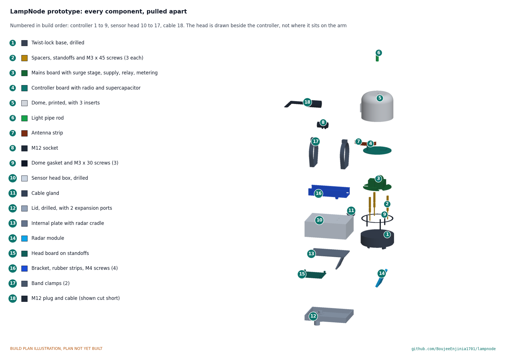

*Figure 1. Every component pulled apart and numbered in build order: the controller (1 to 9), the sensor head (10 to 17) and the cable that joins them (18). The head is drawn beside the controller; on the street it hangs under the arm 470 mm toward the pole.*

The prototype is one LampNode on a bench mock-up of a streetlight: a twist-lock controller that plugs into a luminaire's photocontrol socket, and a small sensor head clamped under a short length of 60 mm tube that stands in for the lamp arm, joined by a 1 m cable. The controller is a bought twist-lock base with two round boards stacked on it and a printed dome over them; the head is a bought plastic box holding a printed plate with a radar module and a small board, screwed to a folded aluminium bracket. Figure 1 shows the 18 components in the order you make or fit them. Ten are made or worked in a small workshop: the drilled base, the two boards, the printed dome with its gasket and light pipe, the drilled box and lid, the printed internal plate, and the folded bracket with its rubber strips. Everything else is bought and fitted. The work is drilling plastic, cutting and folding thin aluminium sheet, two 3D prints, cutting prototype board and wiring bought modules onto it. The parts cost about USD 143 from the bill of materials.

> **Safety:** The controller works at mains voltage, up to 277 V AC nominal and 305 V at most. Build and check both boards unpowered. The first power-up is only through an isolating transformer and a residual current device, with the dome screwed on, at the safety stops of section 6. Never fit the prototype to a streetlight: that needs a laid-out circuit board, tests, a qualified electrician and the asset owner's permission. Cut aluminium and cut circuit board have sharp edges, and cutting circuit board makes glass-fibre dust: cut it wet or with extraction and wear a dust mask. Printing ASA gives off fumes; print in a ventilated space. Heat-set insert tools run at about 230 °C.

## 2. What changed to make it buildable

The concept showed what LampNode does; most of the parts inside it floated with nothing holding them, and some fixings could not be made as drawn. Each change below keeps what LampNode does, and all of them are recorded in decision record LPN-DDR-003, open for Amish's review.

*Table 1. Changes from the concept.*

| Component | The concept had | The buildable design has | Why |
| --- | --- | --- | --- |
| Parts inside the controller | Supply, relay and boards floating at different heights | Two round boards: the mains board on three 12 mm spacers carrying the surge parts, supply, relay and metering; the controller board on three 30 mm standoffs above it (Figure 7) | Every part now sits on something and is held |
| Dome to base | No fixing, no seal | Three bosses inside the dome foot with brass inserts, three screws from under the base, a 1 mm rubber ring under the dome (Figure 11) | No screw shows outside or passes through a seal |
| Base | Solid, undrilled | Six holes on a 60 mm circle between the blades, countersunk from below (Figure 3) | The only place inside the base gasket and clear of the contacts |
| M12 socket | On the curved side of the bought base | On a flat printed pad on the pole side of the dome (Figure 12) | A panel socket needs a flat face to seal on |
| Light window | An open 16 mm hole above the light pipe | An 8 mm clear rod sealed through the dome top, ending just above the light sensor (Figure 13) | One part is window and pipe, and rain stays out |
| Antenna | A rod standing on the board | A flexible strip stuck inside the dome wall (Figure 10) | Matches the part bought |
| Supply and surge parts | A large supply block and two small varistor discs | A real 5 W module size and one standing 20 mm varistor (Figure 6) | Room for the bosses, standoffs and socket |
| Inside the sensor head | A closed box with the board and radar floating | Box and lid; a printed plate on the box's own bosses, carrying the board and a 25° cradle for the radar (Figure 17) | Uses the bosses a stock box already has |
| Ports and gland | Hanging under the box, no holes or nuts | Ports through the lid and a gland in the side wall, each with a nut inside (Figure 17) | Every opening is sealed |
| Bracket and clamps | A solid block longer than the box, fused to two thick rings | A folded aluminium channel with rubber strips and band slots; the bands go over the arm and through the slots (Figure 19) | A channel centres itself on arms from 50 to 80 mm, and nothing is drilled in the arm |
| Cable route | Through the luminaire body and into the arm | Level out of the dome, past the luminaire, then along the top of the arm with cable ties | Clears everything, with a slack loop for the quarter turn |

## 3. Making the components

Make and check each component before the assembly step that needs it. Sizes are in millimetres. "Street side" means toward the luminaire end of the arm and "pole side" toward the pole; "left" and "right" are as seen standing at the pole looking along the arm. Angles round the controller are counted from the street side, anticlockwise seen from above. Workshop tolerance is 0.5 mm unless a step says otherwise; drawings do not carry tolerances before TRL 4.

### 3.1 Twist-lock base, drilled

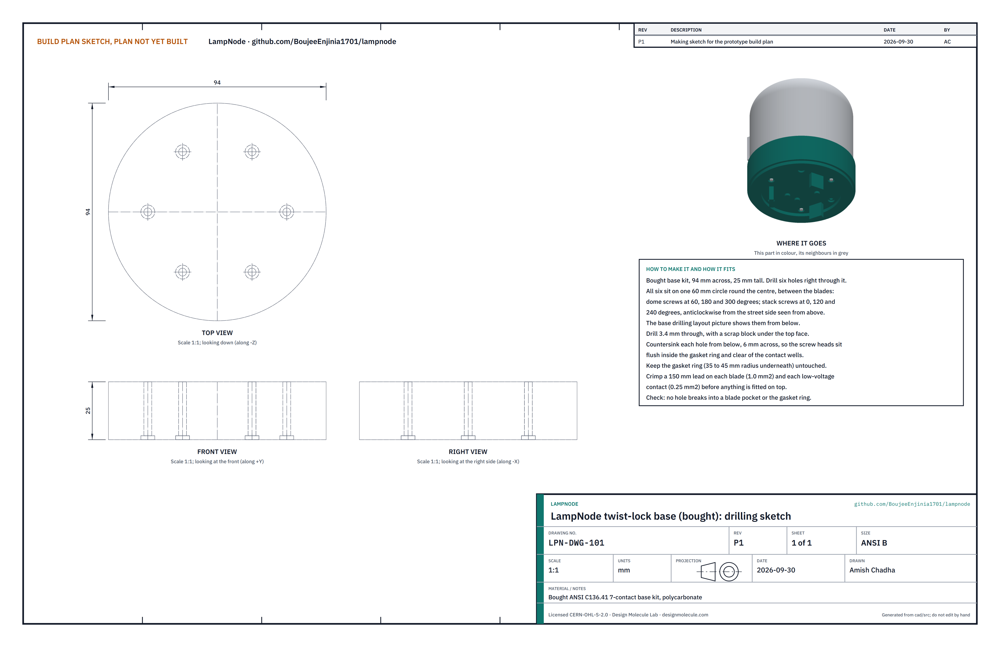

*Figure 2. Twist-lock base drilling sketch (LPN-DWG-101).*

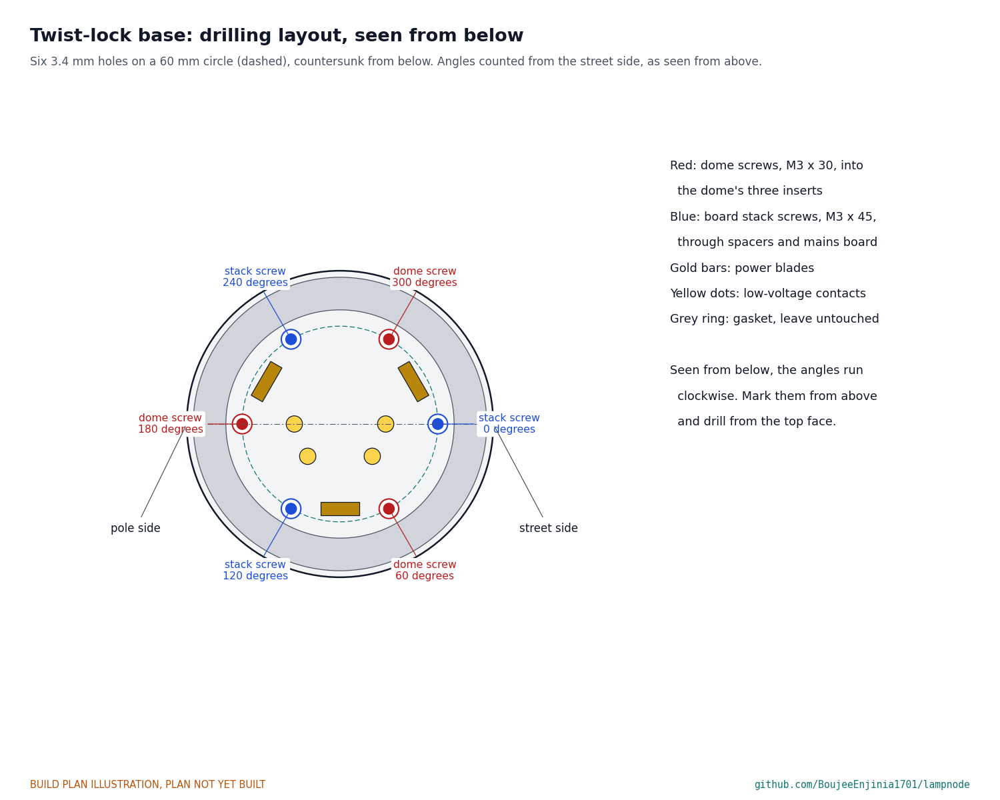

*Figure 3. The six holes, seen from below: red for the dome screws, blue for the board stack screws.*

**What it is and what it is made from.** The bought plug that turns into the luminaire's socket: a polycarbonate disc 94 across and 25 tall, with three power blades, four low-voltage contact pads and a gasket on its underside. Six holes are drilled through it.

**How to make it.**

1. Mark a 60 mm circle on the top face, centred. Mark the pole side (the side the M12 socket will face) and call it 180°.
2. Mark six points on the circle: the dome screws at 60°, 180° and 300°, and the stack screws at 0°, 120° and 240°. Each lies half way between two blades.
3. Support the top face on a scrap block and drill 3.4 mm through at each point.
4. Turn the base over and countersink each hole to 6 mm across, so the screw heads sit flush. Do not touch the gasket ring, which runs from 35 to 45 mm out from the centre.
5. Crimp or solder a 150 mm lead to the inside terminal of each power blade (1.0 mm², 18 AWG) and of each low-voltage contact (0.25 mm², 24 AWG), and label them.

**How it fits the parts next to it.**

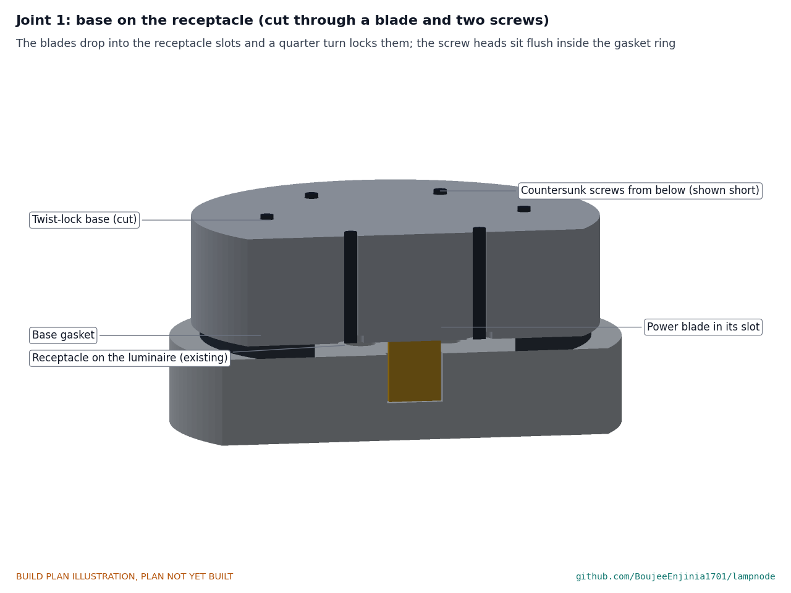

*Figure 4. The blades drop into the receptacle slots; a quarter turn locks them, and the base gasket seals against the receptacle top.*

The blades and contacts fit the luminaire's ANSI C136.41 receptacle with no change to it. The six countersunk heads sit inside the gasket ring, so the seal is untouched. The mains board stack and the dome screw onto the top face (Figures 7 and 11).

**Check before moving on.** No hole breaks into a blade pocket, a contact well or the gasket ring; every screw head sits flush or just below the underside.

### 3.2 Mains board

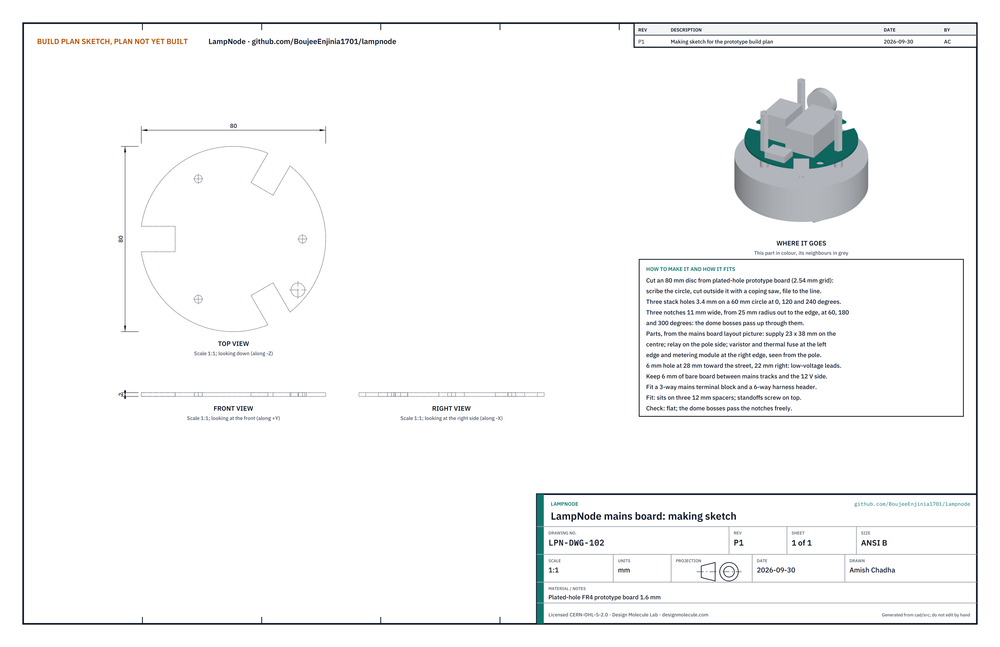

*Figure 5. Mains board making sketch (LPN-DWG-102).*

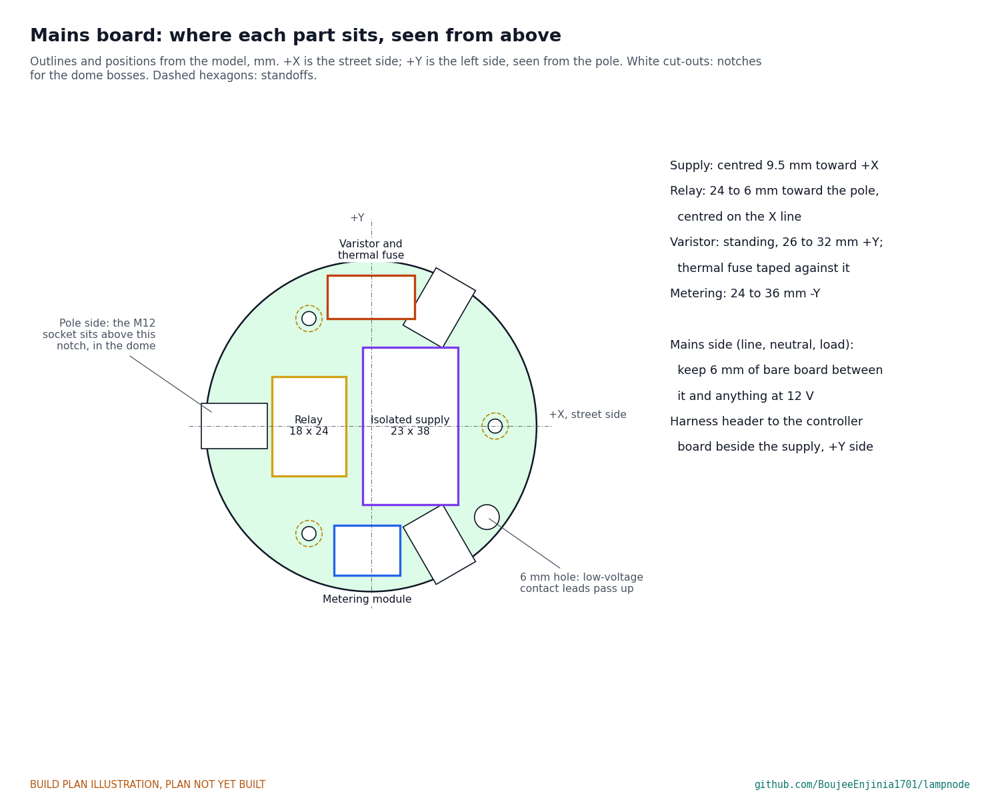

*Figure 6. Parts on the mains board, seen from above, with the three notches and the three stack holes.*

**What it is and what it is made from.** The lower board, which carries everything at mains voltage: the thermal fuse and varistor, the relay that switches the lamp, the metering module, and the isolated supply that makes 12 V for everything else. An 80 mm disc of plated-hole glass-fibre prototype board, 1.6 mm thick.

**How to make it.**

1. Scribe an 80 mm circle on the board and cut just outside it with a coping saw, wet or with extraction. File to the line.
2. Drill the three stack holes 3.4 mm on a 60 mm circle at 0°, 120° and 240°.
3. Cut three notches 11 wide from 25 mm out to the edge at 60°, 180° and 300°: saw the sides and snap out the middle. The dome bosses pass up through them.
4. Drill a 6 mm hole 28 toward the street side and 22 to the right of centre, for the low-voltage contact leads to pass up to the controller board.
5. Place the parts as Figure 6 shows: the supply on the centre, the relay on the pole side, the varistor standing at the left edge with the thermal fuse taped against it, and the metering module at the right edge. Keep 6 mm of bare board between anything at mains voltage and anything at 12 V.
6. Fit a 3-way terminal block for the base leads (line, neutral, load) and a 6-way pluggable header for the harness to the controller board.
7. Wire the board as Figure 8 shows (section 3.2.1).

**How it fits the parts next to it.**

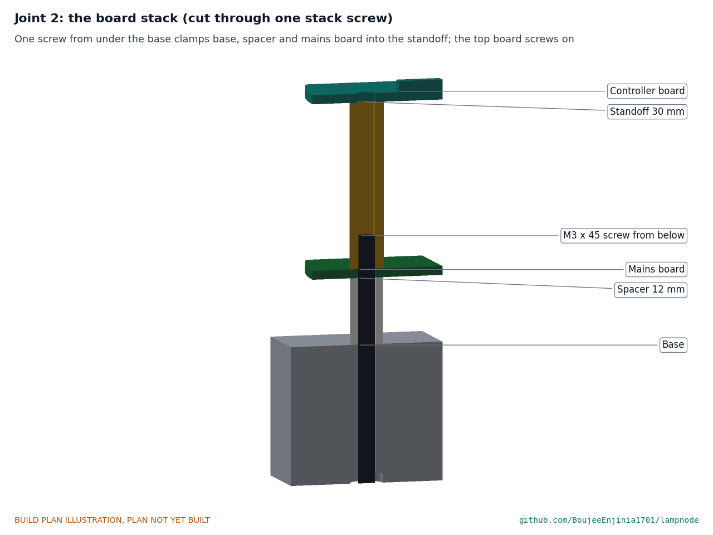

*Figure 7. At each of the three stack points one screw from under the base clamps base, spacer and mains board into a standoff; the controller board screws on top.*

The board sits on three nylon spacers 12 tall, its underside 12 above the base. At each stack point an M3 x 45 countersunk screw goes up through the base, the spacer and the board into a 30 mm brass standoff. The dome bosses pass through the notches with 1 mm to spare.

**Check before moving on.** The board sits flat; the parts stand no taller than 22 mm; every mains joint is soldered and inspected under a lamp.

#### 3.2.1 Wiring

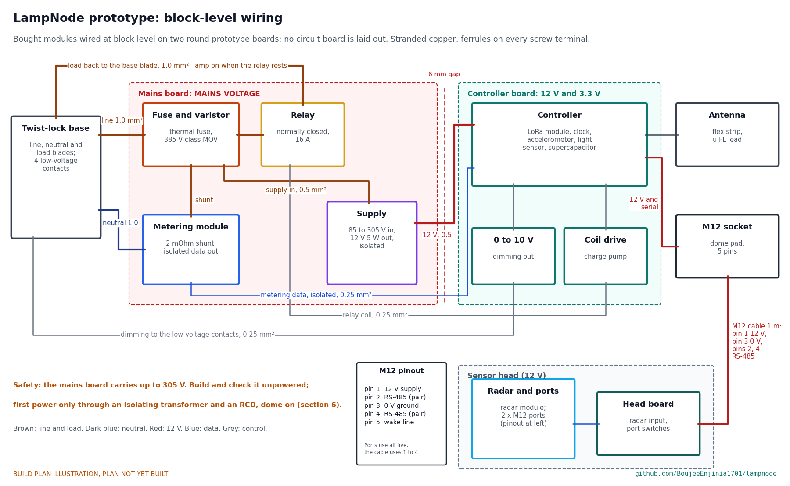

*Figure 8. Block-level wiring with wire sizes. No circuit board is laid out at this stage; bought modules on prototype board stand in for it.*

The mains and controller circuits in the bill of materials will become laid-out boards at TRL 4. For this prototype, buy modules that meet this specification and wire them on the two round boards:

*Table 2. Modules for the two boards.*

| Module | What to buy |
| --- | --- |
| Supply | Encapsulated board-mount AC to DC module, 85 to 305 V AC in, 12 V 5 W out, reinforced isolation, no larger than 23 x 38 x 18 mm |
| Relay | Normally closed power relay, 16 A at 277 V AC, 12 V coil, rated for 80 A inrush or more, no larger than 18 x 24 x 20 mm |
| Surge parts | 20 mm class varistor of 385 V class with a thermal fuse, and transient voltage suppressor diodes for the low-voltage leads |
| Metering | Single-phase metering IC module with a 2 mΩ shunt and an isolated serial output, about 16 x 12 mm |
| Controller | STM32WL-class LoRaWAN module on its maker's breakout, temperature-compensated clock, accelerometer and ambient light sensor breakouts, a 0 to 10 V output stage, a charge-pump relay coil drive and a 0.22 F 5.5 V supercapacitor |

Wire it like this, with stranded copper and a ferrule on every screw terminal:

1. Base line lead to the terminal block, through the thermal fuse, to the varistor and the relay's common contact: 1.0 mm² (18 AWG).
2. Base neutral lead to the terminal block, the varistor and the supply input: 1.0 mm².
3. Relay normally closed contact back through the metering shunt to the base load lead: 1.0 mm². With the relay at rest the lamp is on.
4. Supply input from line and neutral after the fuse: 0.5 mm² (20 AWG).
5. Supply 12 V output to the harness header: 0.5 mm².
6. Metering module isolated data and the relay coil to the harness header: 0.25 mm² (24 AWG).
7. Low-voltage contact leads up through the 6 mm hole to the controller board's dimming output: 0.25 mm², twisted.
8. The antenna lead and the M12 socket leads plug into the controller board when the dome goes on (step 4).

**Check before moving on.** With nothing powered: every wire continues end to end; line, neutral and load read open to every 12 V point; the relay contact reads closed (lamp on) with the coil unpowered.

### 3.3 Controller board

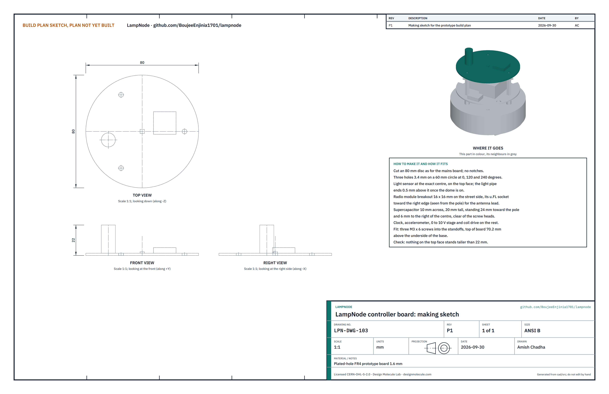

*Figure 9. Controller board making sketch (LPN-DWG-103).*

**What it is and what it is made from.** The upper board: the radio, clock, light sensor, dimming output and relay drive, all at 12 V and below. An 80 mm disc of the same prototype board, with no notches.

**How to make it.**

1. Cut the disc as in section 3.2 and drill the three stack holes 3.4 mm at 0°, 120° and 240°.
2. Fit the light sensor at the exact centre of the top face. The light pipe will end 0.5 mm above it.
3. Fit the radio breakout on the street side, its antenna socket toward the right edge.
4. Stand the supercapacitor 24 toward the pole and 6 to the right of centre, clear of the screw heads.
5. Fit the clock, accelerometer, dimming stage and coil drive on the rest of the board, and the matching 6-way harness plug.

**How it fits the parts next to it.** Three M3 x 6 screws hold it on the standoffs, its top face 70.2 above the underside of the base and 23.8 below the inside of the dome top (Figure 7). Nothing on its top may stand taller than 22 mm.

**Check before moving on.** The harness plugs in without strain; the board drops onto the standoffs with the holes lined up.

### 3.4 Dome, with its gasket, light pipe, antenna and M12 socket

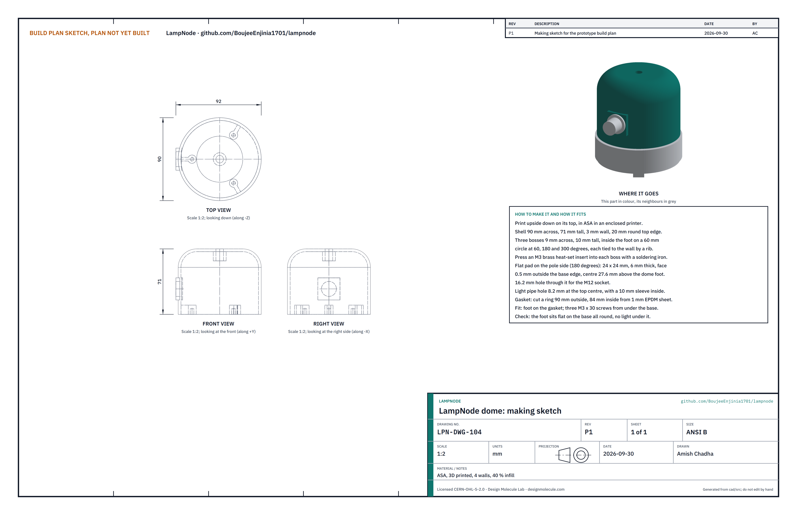

*Figure 10. Dome making sketch (LPN-DWG-104).*

**What it is and what it is made from.** The weatherproof cover: a printed shell 90 across and 71 tall in ASA, which resists sunlight. It carries the light pipe in its top, the antenna on its inside wall and the M12 socket in a flat pad on the pole side.

**How to make it.**

1. Print the dome upside down, standing on its top, in an enclosed printer: 4 walls, 40 % infill. Let it cool on the bed.
2. Press an M3 brass heat-set insert into each of the three bosses with a soldering iron and insert tip, square to the foot.
3. Cut the gasket: a ring 90 outside and 84 inside, from 1 mm EPDM rubber sheet, with a sharp knife against a printed or cut template.
4. Light pipe: cut 8 mm clear acrylic rod 25.3 long, polish both ends, push it into the hole in the top flush with the outside, and seal it with a thin bead of clear UV-stable silicone round the outside.
5. Antenna: clean the inside wall on the right side, between 20 and 30 above the foot, and stick the flexible antenna strip there, centred on the right-hand side, its lead pointing up.
6. M12 socket: fit it from outside through the 16.2 mm hole in the pad, with its seal outside and its nut inside, to the maker's torque. Solder a 120 mm lead set to it with a plug for the controller board.

**How it fits the parts next to it.**

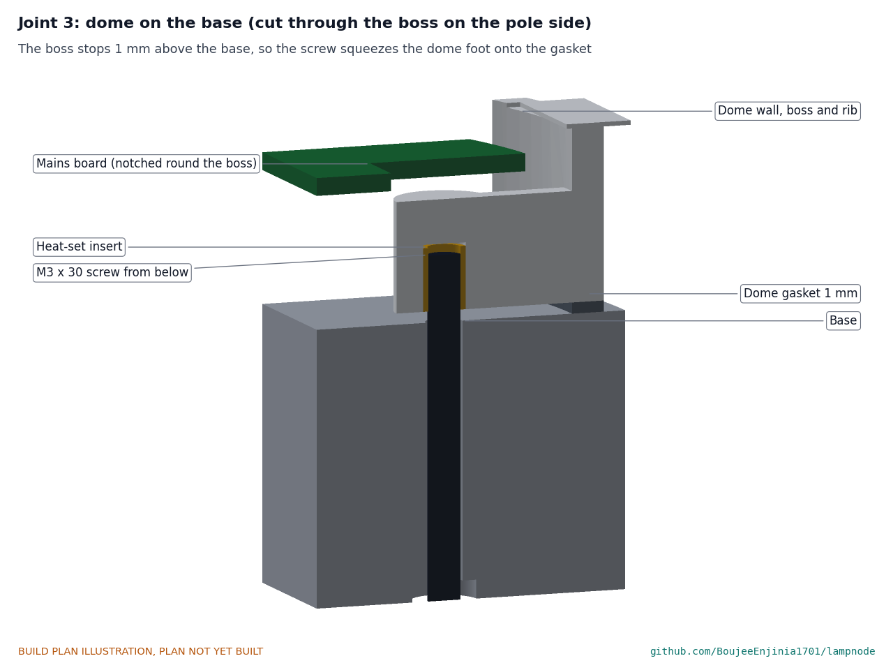

*Figure 11. Each boss stops 1 mm above the base, so the screw squeezes the dome foot onto the rubber ring.*

The dome foot sits on the rubber ring on the top face of the base. Three M3 x 30 countersunk screws come up from under the base into the inserts. The bosses pass through the mains board notches.

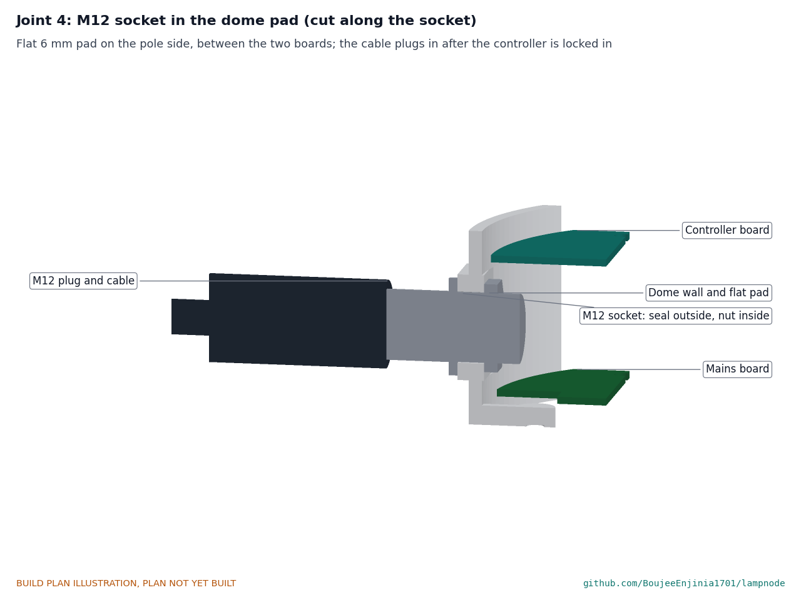

*Figure 12. The flat 6 mm pad on the pole side, with the socket's seal outside and its nut inside.*

The socket sits between the two boards, 3 mm or more from every part on them. The cable plug goes on only after the controller is turned into the receptacle (step 11).

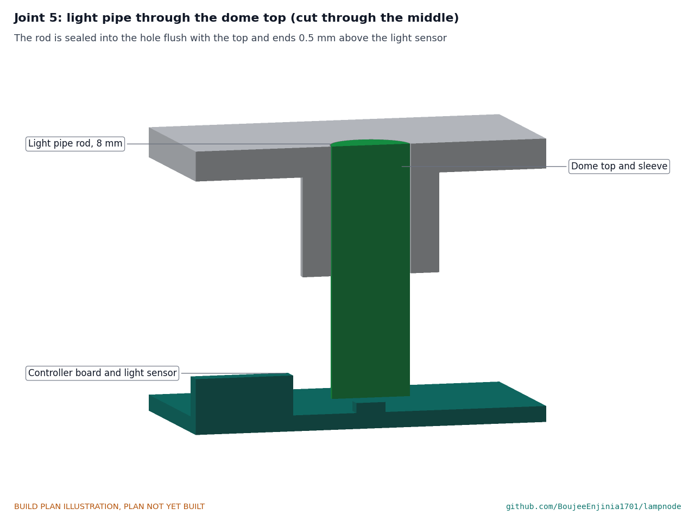

*Figure 13. The rod is sealed into the dome top and ends 0.5 mm above the light sensor.*

**Check before moving on.** On a trial fit over the board stack the dome foot sits flat on the base all round with no light under it; the rod ends 0.5 mm, give or take 0.3, above the sensor (check with a feeler gauge through the side before the dome is screwed down).

### 3.5 Sensor head box and lid, drilled, with the gland and ports

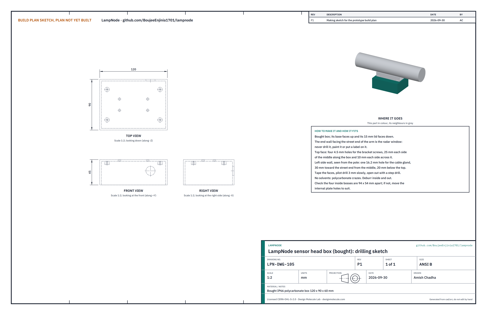

*Figure 14. Sensor head box drilling sketch (LPN-DWG-105).*

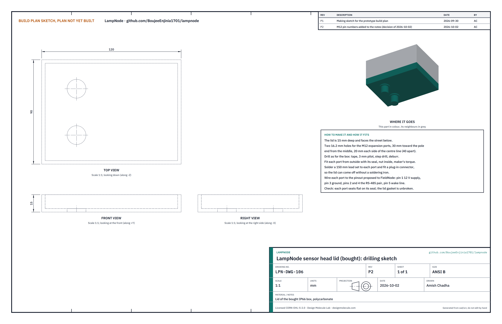

*Figure 15. Sensor head lid drilling sketch (LPN-DWG-106).*

**What it is and what it is made from.** A bought grey polycarbonate box 120 long, 90 wide and 60 tall, rated IP66, with a 15 mm deep gasketed lid and four moulded bosses inside its base. It hangs base up, lid down. Its street-side end wall is the radar window.

**How to make it.**

1. Cover the faces to be drilled with masking tape.
2. Top face (the box's base): four 4.5 mm holes, 25 each side of the middle along the box and 10 each side of the centre line across it.
3. Left side wall: one 16.2 mm hole for the cable gland, 30 toward the street end from the middle and 20 below the top face.
4. Lid: two 16.2 mm holes for the expansion ports, 30 toward the pole end from the middle and 20 each side of the centre line.
5. Pilot drill every hole 3 mm at low speed with wood behind, open out with a step drill, light pressure, and deburr inside and out. Clean with water and mild soap only; solvents craze polycarbonate.
6. Never drill, paint or label the street-side end wall.
7. Fit the gland in the side wall and the two ports in the lid, each from outside with its seal, nut inside, to the maker's torque. Solder a 150 mm lead set to each port with a plug for the head board.

**How it fits the parts next to it.** The bracket screws onto the top face (Figure 20); the internal plate screws onto the bosses (Figure 17); the lid closes on its own gasket with its captive screws.

**Check before moving on.** Each gland and port seats flat on its seal; no crack runs from any hole under a bright lamp; the bosses are 94 by 54 apart (if not, move the internal plate holes to suit before printing it).

### 3.6 Head internal plate with the radar and head board

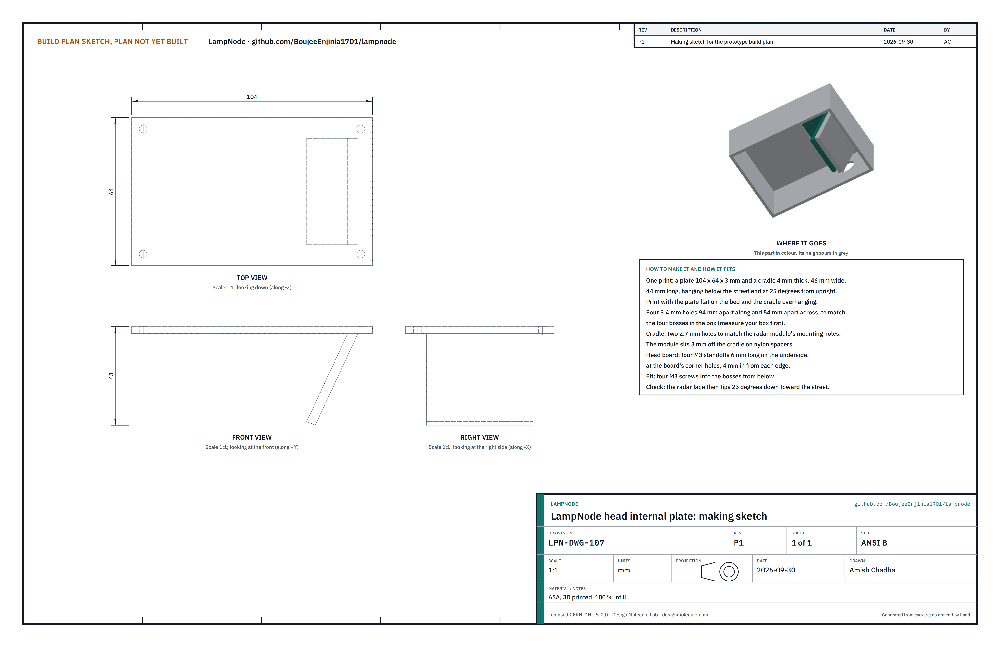

*Figure 16. Head internal plate making sketch (LPN-DWG-107).*

**What it is and what it is made from.** One printed part in ASA, 100 % infill: a plate 104 x 64 x 3 that screws to the box's bosses, with a cradle at its street end that holds the radar module 25° down from upright, looking along the street.

**How to make it.**

1. Print it with the plate flat on the bed; the cradle overhangs at 25° and needs no support.
2. Check the four holes against the box's bosses (94 x 54 apart) and the two cradle holes against your radar module; drill them out to 3.4 and 2.7 if the print closed them up.
3. Fit four M3 standoffs 6 long under the plate for the head board.
4. Fit the radar module to the cradle on two M2.5 screws with 3 mm nylon spacers, its face toward the street end.
5. Fit the head board (65 x 56, prototype board with the microcontroller, regulator and port switch modules) on the standoffs with four M3 screws.

**How it fits the parts next to it.**

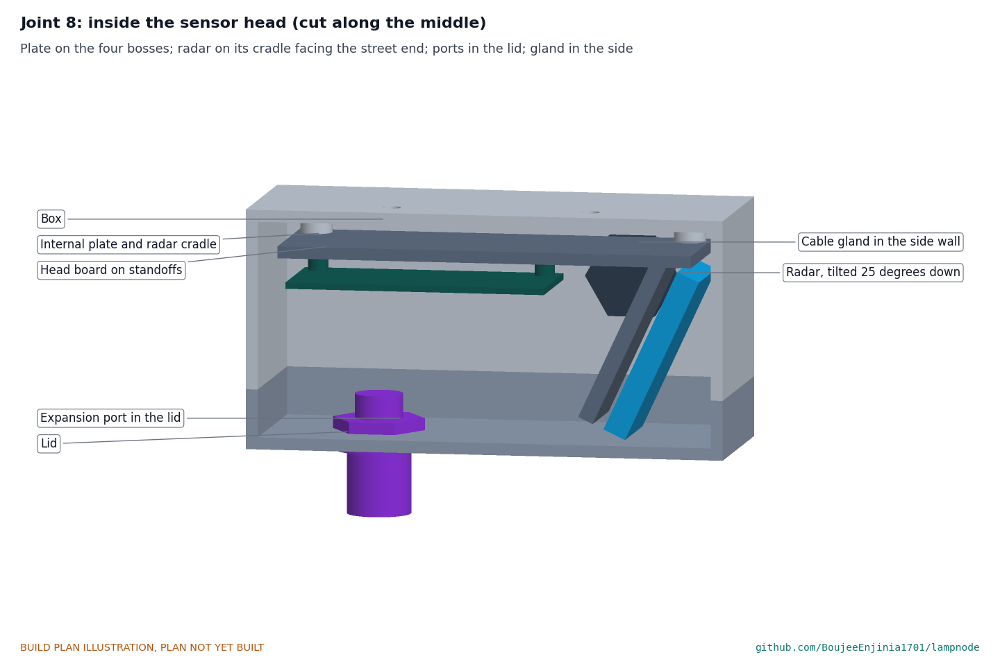

*Figure 17. The plate sits on the four bosses; the radar faces the street end wall 1.6 mm or more clear of the box and lid; the ports come through the lid and the gland through the side.*

Four M3 screws hold the plate to the bosses, 6 below the inside of the box top. The radar hangs 1 mm below the plate, clear of the lid by 1.6 mm. The bracket screw nuts sit 1.3 above the plate.

**Check before moving on.** Laid on a flat surface the plate does not rock; the radar face tips 25° (give or take 2°) from upright, checked with an angle finder.

### 3.7 Bracket and rubber strips

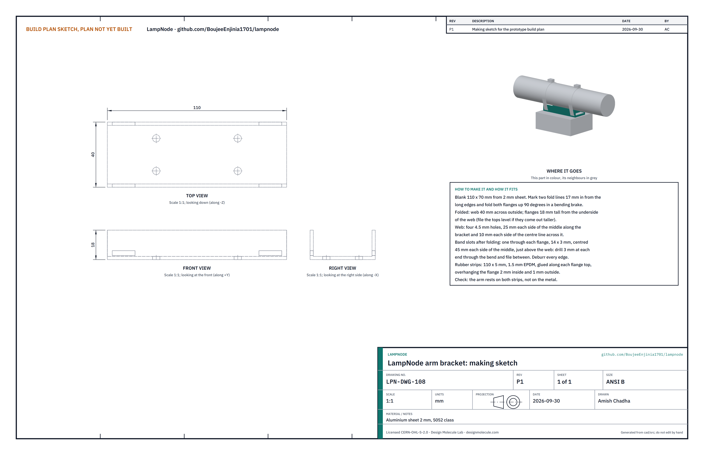

*Figure 18. Bracket making sketch (LPN-DWG-108).*

**What it is and what it is made from.** A channel folded from 2 mm aluminium sheet, 5052 class, that the box screws to and the lamp arm rests on, with two band clamps holding it to the arm. Two strips of 1.5 mm EPDM rubber keep the arm off the metal.

**How to make it.**

1. Cut a blank 110 x 70 and deburr it. Mark two fold lines 17 in from the long edges.
2. Drill the four 4.5 mm screw holes in the web: 25 each side of the middle along the bracket, 10 each side of the centre line across it.
3. Fold both flanges up 90° in a bending brake. Folded, the web is 40 across outside and the flanges stand 18 from the underside of the web; file the flange tops level if they come out taller.
4. Cut the band slots after folding: in each flange, 14 long and 3 tall, centred 45 each side of the middle, just above the web. Drill 3 mm at each end through the bend and file between.
5. Cut two strips of 1.5 mm EPDM 110 x 5 and glue one along each flange top, overhanging the flange 2 inside and 1 outside.

**How it fits the parts next to it.**

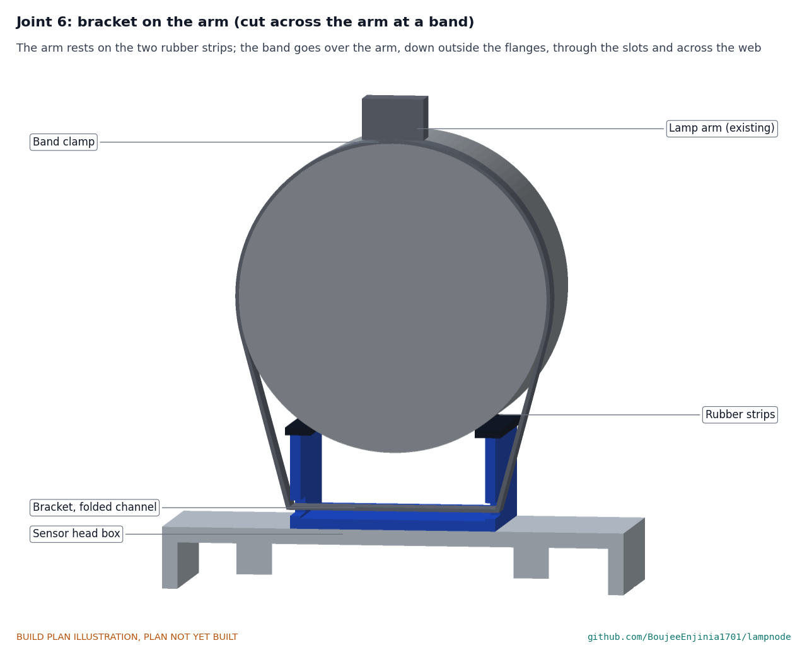

*Figure 19. Section across the arm at one band: the arm rests on both rubber strips, and the band goes over the arm, down outside the flanges, through the slots and across the web.*

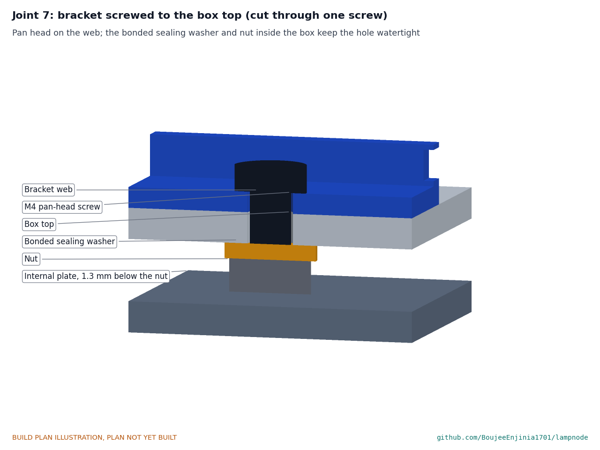

*Figure 20. Pan head on the web; bonded sealing washer and nut inside the box.*

The web sits flat on the box top, held by four M4 x 12 pan-head screws with bonded sealing washers and nuts inside the box. A 60 mm arm touches the strips 16 out from the centre line and clears the metal by 2 or more; arms from 50 to 80 mm also sit on both strips. The box top hangs 15 below a 60 mm arm.

**Check before moving on.** Laid on a length of 60 mm tube the bracket does not rock and no metal touches the tube.

### 3.8 Bought components

Buy to specification, not brand. Line numbers are those of the bill of materials.

- **Twist-lock base (line 1).** ANSI C136.41 7-contact photocontrol base kit with gasket, with solid material or bosses at the six screw points (check before drilling).
- **Surge parts, supply, relay and metering (lines 3 to 6) and the controller parts (line 7).** As Table 2.
- **Antenna (line 8).** Flexible sub-GHz antenna about 70 x 10 with an adhesive back and a u.FL lead, for the band of the first partner's region (868 or 915 MHz).
- **Light sensor and pipe (line 9).** Ambient light sensor breakout; 8 mm clear acrylic rod.
- **M12 socket and cable (line 10).** 5-pole A-coded M12 panel socket with an M16 thread for walls up to 6 mm; 1 m UV-rated single-ended M12 cordset.
- **Sensor head box (line 11).** As section 3.5, with one M16 nylon cable gland for 4 to 8 mm cable.
- **Radar (line 12).** 24 GHz Doppler module with I/Q output, no larger than 50 x 44, with two mounting holes.
- **Head board parts (line 13).** Small microcontroller board, 12 V to 3.3 V regulator, two fused high-side switch modules, radar signal amplifier.
- **Expansion ports (line 14).** Two 5-pole A-coded M12 panel sockets with caps.
- **Band clamps (line 15).** Two stainless worm-drive clamps with 12 mm band; the loop is about 220 mm for a 60 mm arm (about 190 for 50 mm and 280 for 80 mm).
- **Fixings and boards (lines 16 and 17).** Three 12 mm nylon spacers; three M3 x 30 female-female brass standoffs; three M3 brass heat-set inserts; three M3 x 30 and three M3 x 45 countersunk screws; three M3 x 6 screws; four M4 x 12 pan-head screws with bonded sealing washers and nuts; two 100 x 100 plated-hole prototype boards; 1 mm EPDM sheet; terminal blocks, pluggable headers, wire, ferrules, UV-stable cable ties, desiccant pack.
- **Head plate fixings (line 18).** Four M3 x 6 standoffs, M3 screws, two M2.5 screws with 3 mm nylon spacers.

## 4. Putting it together

In each picture the parts already fitted are grey and the part being fitted is in colour, with an arrow showing the way it goes in. The bench mock-up is a donor ANSI C136.41 receptacle screwed to a board and a 600 mm length of 60 mm steel or aluminium tube held in a vice or clamped to the bench.

### Step 1: board stack onto the base

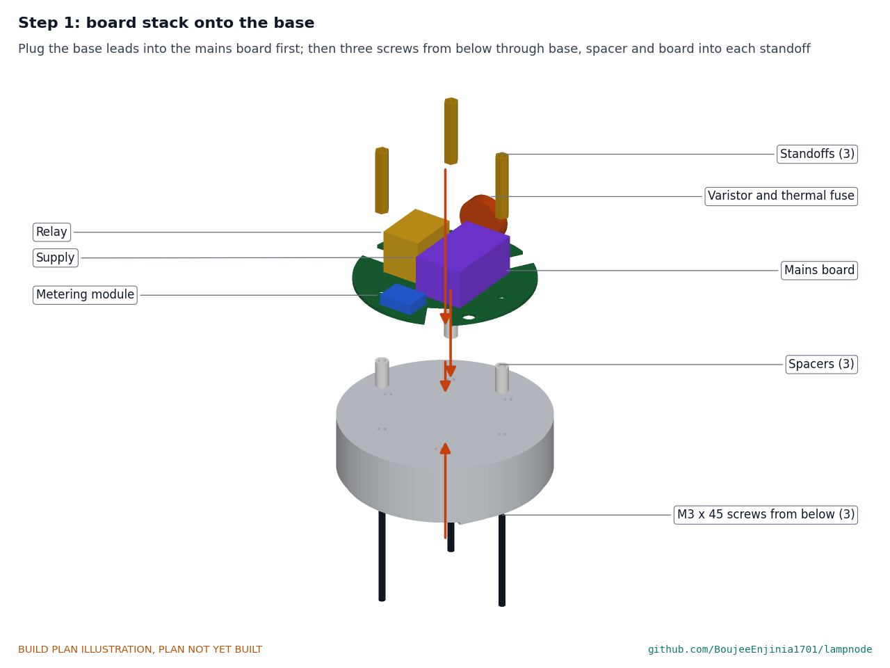

Plug the base leads into the mains board terminal block and feed the low-voltage leads up through the 6 mm hole. Stand the spacers on the base over the three stack holes, lay the mains board on them, stand a standoff over each hole, and fit three M3 x 45 countersunk screws from under the base, snug. **Hold point:** the unpowered checks of section 3.2.1 pass again.

### Step 2: controller board onto the standoffs

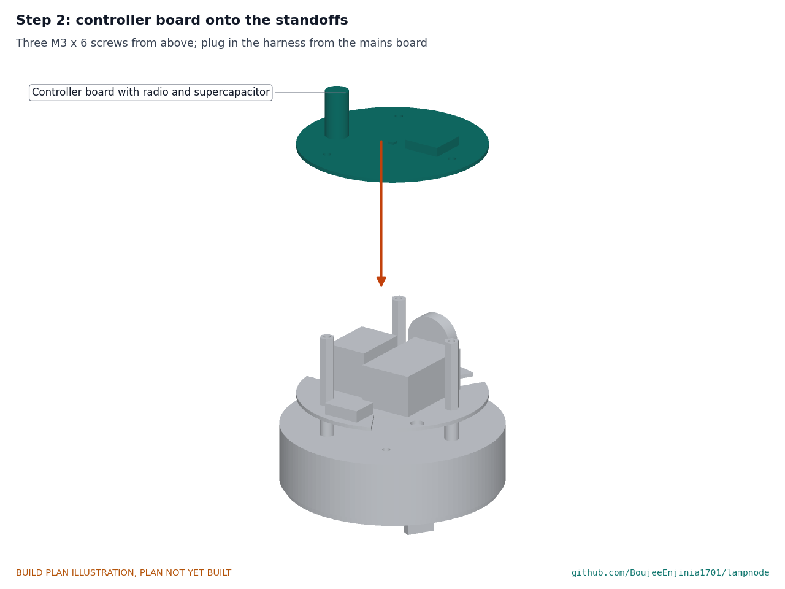

Plug in the harness from the mains board and connect the low-voltage leads to the dimming output. Fit the board with three M3 x 6 screws.

### Step 3: light pipe, antenna and M12 socket into the dome

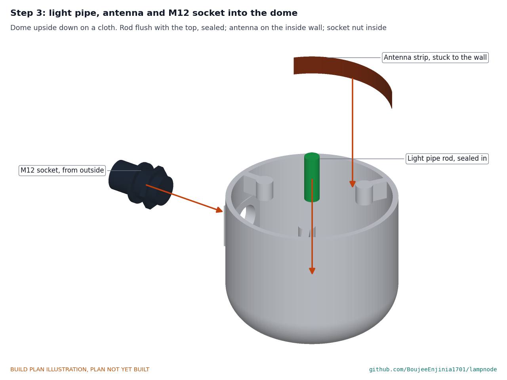

With the dome upside down on a soft cloth, fit the rod, the antenna and the socket as section 3.4 describes. Let the silicone cure for a day.

### Step 4: dome onto the base

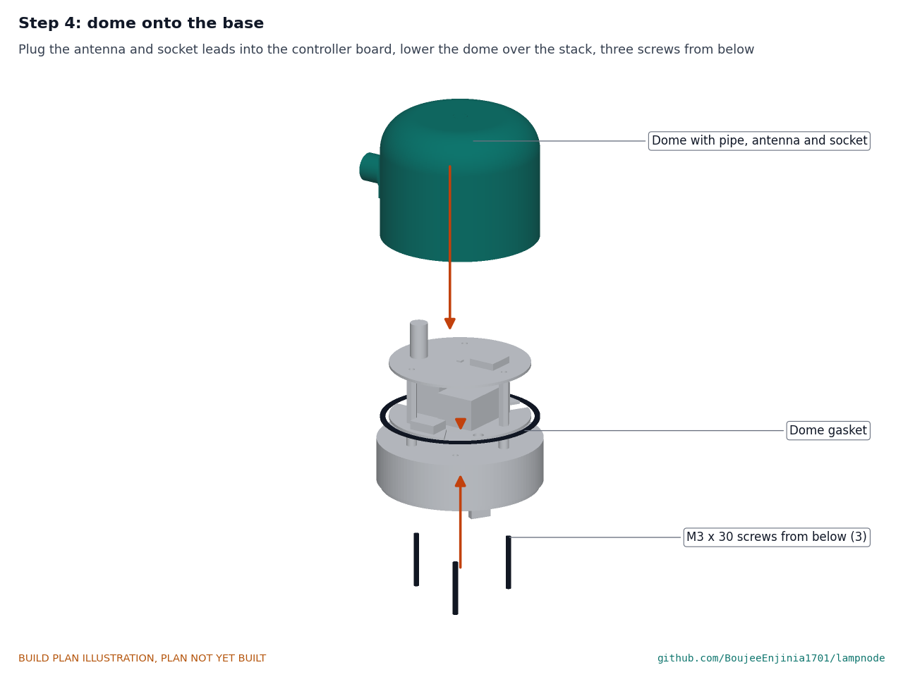

Plug the antenna lead into the radio and the socket leads into the controller board. Lay the rubber ring on the base, lower the dome over the stack so the bosses pass through the notches, and fit three M3 x 30 countersunk screws from under the base, tightened evenly until the ring is just squeezed. **Hold point:** safety stop S2.

### Step 5: gland into the box, ports into the lid

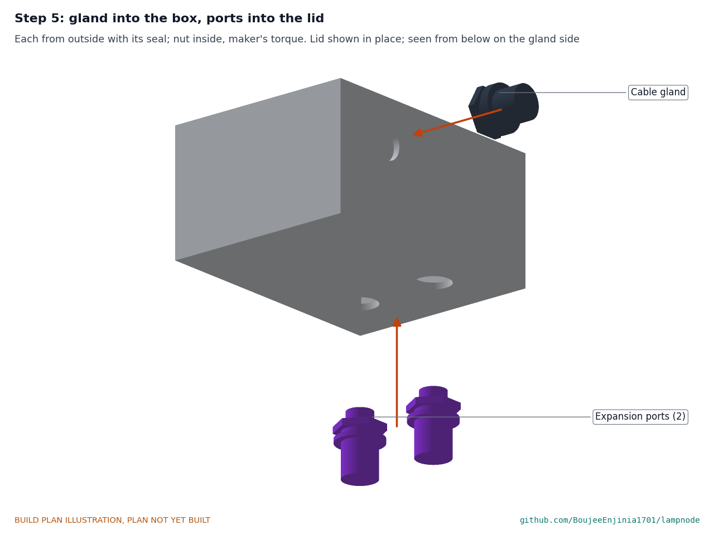

Fit each from outside with its seal, nut inside, to the maker's torque, as section 3.5.

### Step 6: radar and head board onto the internal plate

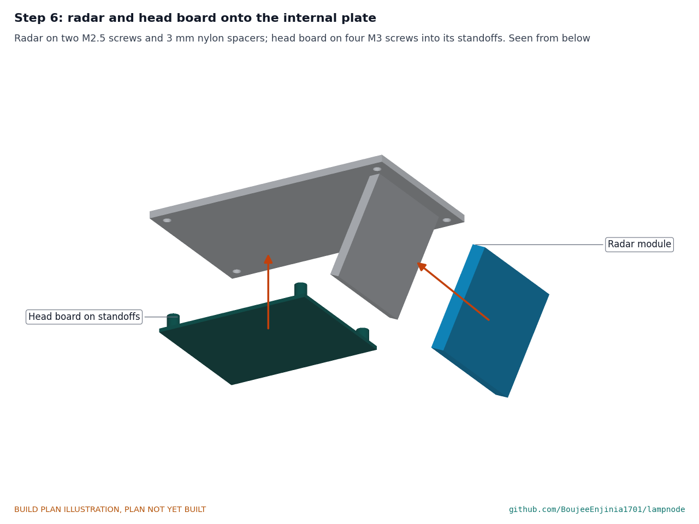

Radar on two M2.5 screws and 3 mm nylon spacers, face toward the street end; head board on four M3 screws into its standoffs.

### Step 7: internal plate into the box

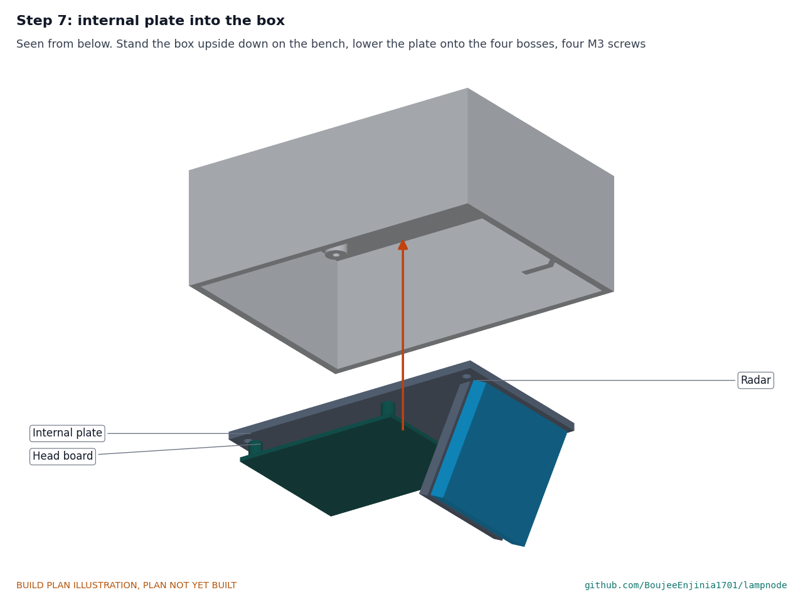

Box upside down on the bench. Four M3 screws through the plate into the bosses.

### Step 8: bracket onto the box top

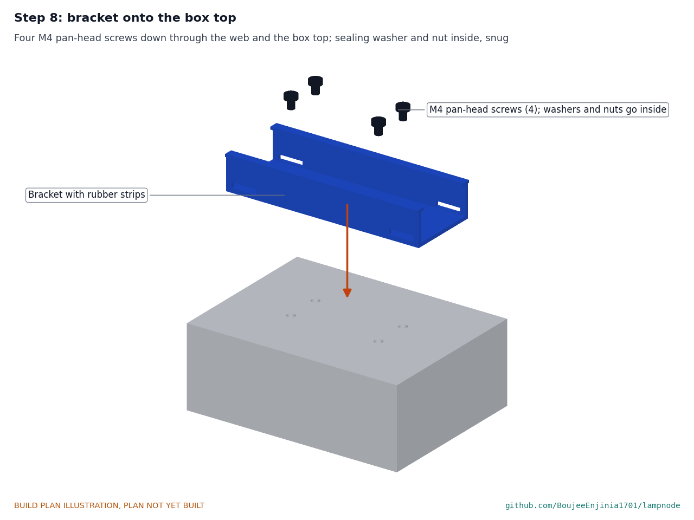

Four M4 x 12 pan-head screws down through the web and the box top, bonded sealing washer and nut inside, snug: the washer should just bulge.

### Step 9: cable in, leads plugged, lid on

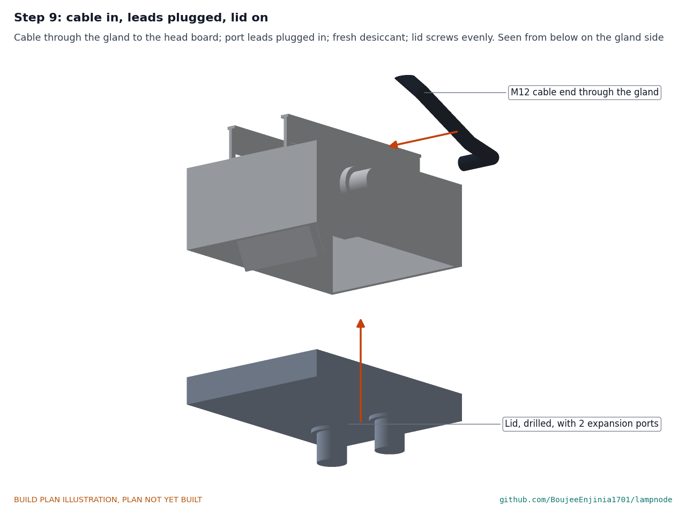

Pass the open end of the M12 cordset through the gland, connect it to the head board (12 V, 0 V and the two data wires) and tighten the gland. Plug in the port leads, add a fresh desiccant pack, check the lid gasket is clean with no wire across it, and tighten the lid screws evenly in a cross pattern.

### Step 10: sensor head onto the arm

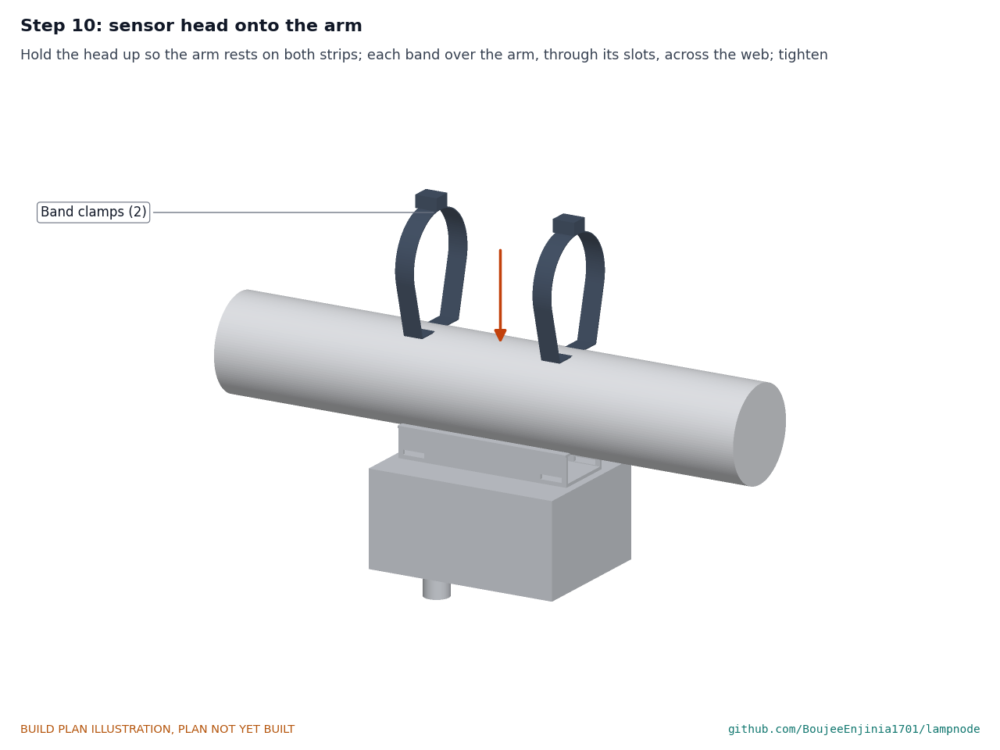

Hold the head up under the tube so the tube rests on both rubber strips, with the radar end wall toward the street end. Pass each band over the tube, down outside the flanges, through its two slots and across the web, and tighten both to the band maker's torque with the worm housing on top. Check the radar end wall is square to the tube.

### Step 11: controller into the receptacle, cable along the arm

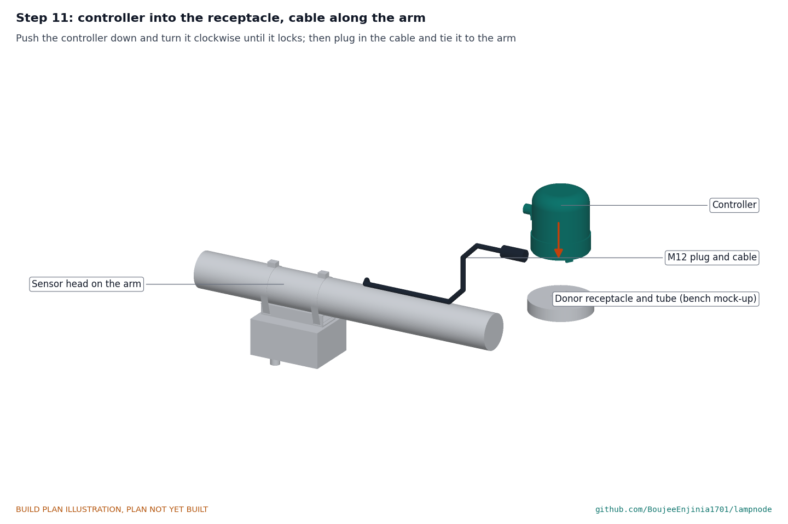

Push the controller into the receptacle with the M12 pad toward the pole and turn it clockwise until it locks. Then plug the cable into the socket, lead it level past the end of the receptacle, down to the top of the tube and along it to the head, leaving a slack loop at the controller, and tie it to the tube every 150 mm. **Hold point:** safety stop S4 before any power.

## 5. First checks

These are the checks a TRL 4 test report would record; this plan only lists them. Requirement numbers are those of LPN-REQ-001.

*Table 3. First checks.*

| Check | Requirement | How | Pass when |
| --- | --- | --- | --- |
| Fits the socket | R1 | Turn the controller into the donor receptacle and out again, timed | Locks and unlocks by hand; blades and contacts seat; under 5 min with gloves |
| Lamp on when unpowered | R12 | Meter across the base line and load blades, nothing powered | Closed circuit |
| Insulation | R2, R11 | 500 V insulation tester between the joined mains blades and every 12 V point, ports and M12 pins | 10 MΩ or more |
| First power | R2, R10 | Through an isolating transformer and an RCD at the local mains voltage, and at 120 V and 277 V from a variable transformer if one is available; dome on; power meter in the line | 12 V present at the M12 socket; average input power 1.0 W or less with the ports unloaded |
| Relay and dimming | R3, R4, R12 | Resistive dummy load of about 100 W on the load blade; command off, on and dim from a laptop; stop the controller | Load switches at the zero crossing (oscilloscope through an isolated probe); 0 to 10 V output covers 1 to 10 V; load comes back on when the controller stops |
| Light sensor and day logic | R5, R12 | Cover and uncover the light pipe in daylight with the clock set to day, then to night | Lamp off only when both clock and light say day |
| Metering | R8 | Dummy load against a bench power meter at 10, 100 and 400 W | Within 2 % after the one-point calibration |
| Radar presence | R6 | Walk toward the bench mock-up from 20 m with the head 2 m up | Presence event before 15 m; lamp output to full within 1 s |
| Ports | R13 | Switch each port on and off; short a port through a test lead | 12 V when on, 0 V when off; the fuse trips on the short and resets |
| Last message | R9 | Remove power while the radio is joined to a test network | The power-lost message arrives |
| Head on the arm | R6 | Angle finder on the radar end wall; push the head by hand | Radar 25° down, give or take 2°; nothing moves at the bracket |

## 6. Safety stops

Stop at each point. Carry on only when everything listed is true.

- **S1. Before any part at mains voltage is soldered.** The board is unpowered and the iron is the only tool plugged in; the mains layout of Figure 6 is marked on the board with the 6 mm gap shown.
- **S2. Before the dome is screwed down for the first power-up.** The unpowered checks of section 3.2.1 pass; the insulation check of section 5 passes; no bare conductor is closer than 6 mm to the 12 V side; the relay reads closed with the coil unpowered.
- **S3. First power-up.** Only through an isolating transformer and an RCD, with the dome screwed on, the controller in the donor receptacle on the bench, and no one touching it. A competent person in mains bench testing is present. Power is removed before the dome is ever taken off.
- **S4. Before a load is switched.** Only a resistive dummy load or a spare LED driver on the bench, behind the same isolating transformer and RCD. Never a public lighting circuit.
- **S5. Before the radio or radar transmits.** The antenna is connected and matches the region's band; both modules are used within local radio rules.
- **S6. Before the head goes on the tube.** Every bracket screw is tight with its sealing washer; all sharp edges are deburred; the tube is clamped so it cannot roll or tip.
- **S7. Before any installation on a streetlight (outside this plan).** A laid-out, tested board, not the hand-wired prototype; the asset owner's permission; a qualified electrician; a bucket truck or platform, fall protection and traffic management as local rules require.

## 7. Tools, skills and workspace

**Tools.** Bench drill or a drill in a stand; drills 2.5 to 6 mm; step drill to 20 mm; countersink; coping saw and fine files; scriber, steel rule, calipers and a protractor; hand bending brake for 2 mm aluminium 110 mm long (or two lengths of steel angle clamped in a vice); 3D printer with an enclosure that prints ASA, bed at least 110 x 110 mm and 75 mm tall; soldering iron with a heat-set insert tip; ferrule crimper, wire strippers and a blade-lead crimper; multimeter; 500 V insulation tester; isolating transformer and plug-in RCD; bench power meter; oscilloscope with an isolated probe; angle finder; torque screwdriver covering about 0.5 to 5 N·m; feeler gauges; heat gun for heat-shrink.

**Skills.** Basic metalwork (marking out, drilling, filing, folding thin sheet), plastic drilling, 3D printing in ASA, through-hole soldering and crimping. Building and checking the boards unpowered needs no certified trade. Powering them is mains work: the first power-up and every powered check must be done by, or under the direct supervision of, a person competent in mains bench testing, and fitting to a real streetlight needs a qualified electrician.

**Workspace.** A bench about 1.2 x 0.6 m with a mains test corner kept apart, fed through the isolating transformer and RCD; the metalwork corner apart from the electronics; a ventilated place for the printer; a vice or clamps for the tube.

**Personal protective equipment.** Safety glasses for cutting, drilling and soldering; a dust mask when cutting circuit board; cut-resistant gloves for sheet; no gloves near a turning drill.

## 8. Where the numbers come from

- Model and constructability checks: `cad/src/model.py` (`python cad/src/model.py --check`, 80 checks); STEP and STL exports in `cad/step/` and `cad/stl/`.
- Pictures: `cad/src/build_plan_media.py`, using `.kit/build_views.py`; written to `docs/05-build-plan/` and `cad/drawings/LPN-DWG-101` to `LPN-DWG-108`.
- General arrangement: `cad/drawings/LPN-DWG-001.pdf`, Rev P3.
- Calculations: `docs/04-calcs/01-sizing.md` (LPN-CAL-001 v0.3) and `docs/04-calcs/sizing.py`; mass in section 12, cost in section 13.
- Bill of materials: `bom/bom.csv`.
- Decisions: `docs/decisions/0003-design-for-construction.md` (LPN-DDR-003), with LPN-DDR-001 and LPN-DDR-002.
- Requirements: `docs/03-requirements.md` (LPN-REQ-001 v0.5).
